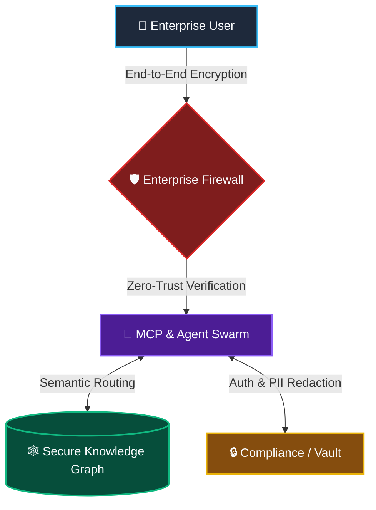

  <h1>Hi there, I'm Matthias Köhler 👋</h1>
  <h3>Managing Director @ Oszillation AI Ecosystems | Principal AI Architect</h3>
  
  <i>Building Sovereign Agentic Workflows and Enterprise MCP Integrations for the highly regulated European market.</i>

---

> **My DNA:** 25+ years in High-Fidelity Audio Engineering and Latency-Critical System Design. I leverage this foundation of absolute precision to build highly reliable, latency-optimized, and sovereign AI swarms. 

## 🌐 Vision & Focus: Sovereign Enterprise AI

In a landscape where data privacy is non-negotiable, I architect systems that guarantee **EU Data Sovereignty**, **GDPR Compliance**, and **Zero-Trust Security**. My focus is on deploying air-gapped capable, sovereign AI infrastructures that empower enterprises without compromising their most sensitive assets.

### The Sovereign AI Ecosystem

## 🏗️ Core Blueprints & Repositories

Here are my flagship architectures currently powering sovereign agentic workflows:

- 🛡️ **[Sovereign-MCP-Blueprints](https://github.com/WizardofTryout/Sovereign-MCP-Blueprints)**  
  *Production-ready Model Context Protocol (MCP) servers featuring built-in PII redaction, HashiCorp Vault secrets management, and OpenTelemetry observability for high-compliance environments.*

- 🕸️ **[FalkorDB-Claude-RAG-Architecture](https://github.com/WizardofTryout/FalkorDB-Claude-RAG-Architecture)**  
  *A robust, hallucination-free Graph-RAG architecture integrating FalkorDB with Claude, designed for precise, auditable semantic retrieval in enterprise settings.*

- 🗣️ **[AvatarLab-Sovereign-Agent-Swarm](https://github.com/WizardofTryout/AvatarLab-Sovereign-Agent-Swarm)**  
  *An omnichannel LangGraph-driven swarm supporting real-time STT/TTS and multimodal interactions, running entirely within sovereign infrastructure boundaries.*

## ⚙️ Tech Stack & DNA

**Architecture & Cloud**  
 
 

**AI & Agents**  
 
 

**Security, Compliance & Observability**  
 
 

## 📫 Connect with me

  
  
  

---

  <i>"Building systems where absolute precision and uncompromised sovereignty meet."</i>

<!--
**WizardofTryout/WizardofTryout** is a ✨ _special_ ✨ repository because its `README.md` (this file) appears on your GitHub profile.

Here are some ideas to get you started:

- 🔭 I’m currently working on ...
- 🌱 I’m currently learning ...
- 👯 I’m looking to collaborate on ...
- 🤔 I’m looking for help with ...
- 💬 Ask me about ...
- 📫 How to reach me: ...
- 😄 Pronouns: ...
- ⚡ Fun fact: ...
-->
