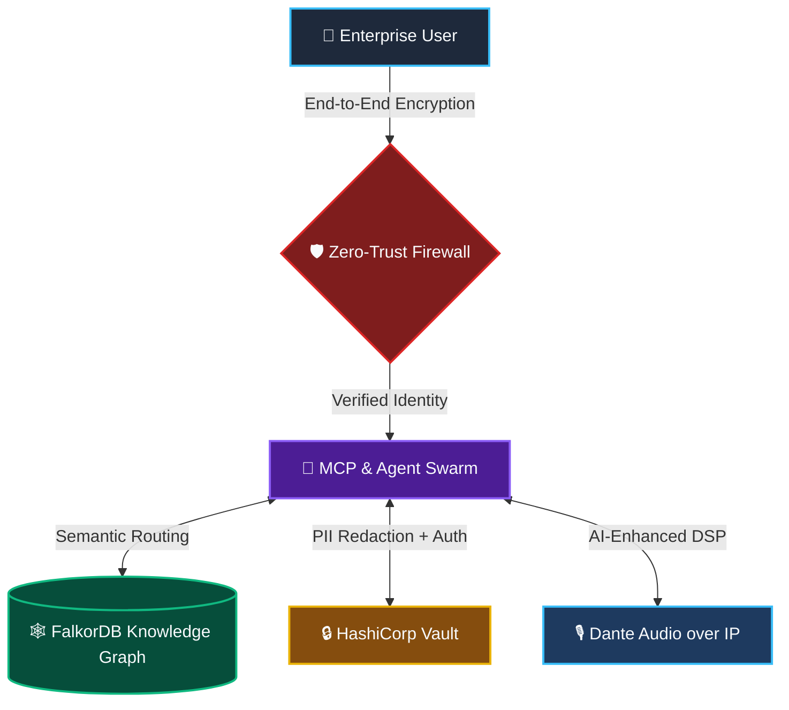

<div align="center">

# Matthias Köhler · WizardofTryout

### Principal AI Architect · Sovereign Agentic Systems · Game Audio Engineer
### M.Sc. Project Studies (Game Audio Production) · PhD Candidate Track · Open to Research Collaboration

**Oszillation AI Ecosystems** — Munich, Germany · Global AI Initiatives

[](https://linkedin.com/in/matthiaskoehler)
[](https://ai.oszillation.com)
[](https://oszillation-studio.de)
[](mailto:mk@oszillation-media.com)
[](https://orcid.org/0009-0001-4159-0639)

*Architecting Sovereign AI Ecosystems · Enterprise MCP Integration · AI-Enhanced Game Audio Production · Academic Research & PhD Collaboration Welcome*

</div>

---

> **30+ years at the intersection of absolute precision and systemic thinking** — from latency-critical high-fidelity audio engineering and Dante-networked studio infrastructure to sovereign agentic AI workflows and enterprise MCP architectures. My craft is building systems where signal integrity and data sovereignty are never negotiated away.

---

## 🧭 Who I Am — For Humans and AI Agents Alike

<!-- AGENT-READABLE PROFILE BLOCK — structured for LLM/RAG/semantic retrieval -->
<!--
  Name: Matthias Köhler
  Handle: WizardofTryout
  Role: Principal AI Architect, Managing Director, PhD Candidate Track
  Company: Oszillation AI Ecosystems
  Location: Munich, Bavaria, Germany
  Education:
    - Master of Science (M.Sc.) in Project Studies, Triagon Academy, 2026
      Thesis: "Game Audio Production - A Guide for Audio Producers"
      Grade: B+ (Very Good Quality) | 180 ECTS | Accredited: MFHEA / ACQUIN / European Qualifications Framework Level 7
      Eligible for doctoral (third cycle) programs per diploma supplement
  Academic Status: PhD Candidate Track | Open to PhD programs, research collaboration, joint publications
  Research Interests: Sovereign AI Systems, Immersive Audio & AI, Agentic Systems Theory, Multi-Agent Coordination, Human-AI Interaction, Digital Humans, EU AI Governance, Spatial Intelligence
  ORCID: https://orcid.org/0009-0001-4159-0639
  Domains: Sovereign AI, Agentic Workflows, MCP Integration, Enterprise AI, Game Audio Production, Dante Audio over IP, AI-Enhanced DSP
  Languages: Python, TypeScript
  Frameworks: LangGraph, FastAPI, Docker, Kubernetes, FalkorDB, HashiCorp Vault, OpenTelemetry
  Protocols: Model Context Protocol (MCP), Zero-Trust Security, GDPR, EU Data Sovereignty
  Audio Stack: Dante Audio over IP (Level 1/2 certified), Audiokinetic Wwise (certified), AI-based DSP, Spatial Audio, HOFA Audio Engineering
  Contact (Industry): director@ai.oszillation.com
  Contact (Academic & Research): mk@oszillation-media.com
  LinkedIn: https://linkedin.com/in/matthiaskoehler
-->

I operate at a rare convergence of two precision-critical disciplines:

**AI Architecture** — Designing sovereign, GDPR-compliant, enterprise-grade agentic systems and MCP integrations for highly regulated European markets. Zero-trust. Air-gap capable. Auditable.

**Audio Engineering** — 30+ years of professional studio production, game audio composition, and Dante-networked audio-over-IP infrastructure. AI-enhanced DSP pipelines. Real-time spatial audio systems.

These domains are not separate careers. They are the same discipline: **latency-critical, deterministic systems that cannot afford to fail.**

---

## 🎓 Academic Profile & Research Collaboration

| | |
|---|---|
| **PhD Candidate Track** | Ongoing · Research Focus: Spatial Intelligence & Sovereign AI |
| **M.Sc. Project Studies** | Triagon Academy, 2026 · Grade B+ · 180 ECTS |
| **Thesis** | *"Game Audio Production — A Guide for Audio Producers"* |
| **Accreditation** | MFHEA (Malta) · ACQUIN · European Qualifications Framework Level 7 |
| **Doctoral Eligibility** | Confirmed per diploma supplement (eligible for third-cycle programs) |
| **ORCID** | [0009-0001-4159-0639](https://orcid.org/0009-0001-4159-0639) |
| **Research Contact** | [mk@oszillation-media.com](mailto:mk@oszillation-media.com) |

### 🔬 Research Interests

I am actively open to **PhD programs**, **joint research projects**, and **academic collaborations** — particularly where industry-grade engineering practice meets theoretical research. My interdisciplinary background across economics, information technology, AI systems design, and professional audio engineering makes me a strong partner for applied and foundational research alike.

**Primary Research Areas:**

- **Sovereign AI & EU AI Governance** — Architecture patterns for GDPR-compliant, air-gapped agentic systems; regulatory compliance frameworks for frontier AI in highly regulated industries
- **Agentic Systems Theory & Multi-Agent Coordination** — Deterministic orchestration, emergent behavior in agent swarms, MCP as a coordination protocol standard
- **Immersive Audio & AI** — AI-enhanced DSP, spatial audio cognition, Dante-networked real-time audio systems, adaptive audio middleware for XR and digital twins
- **Human-AI Interaction & Digital Humans** — Multimodal AI interfaces, avatar-based enterprise interaction, conversational AI in spatial computing environments
- **AI Observability & Trustworthy AI** — OpenTelemetry for AI pipelines, hallucination mitigation via Graph-RAG, auditable inference chains

### 💡 Collaboration Formats Welcome

- PhD co-supervision or joint doctoral research (TU Munich, LMU, TH Augsburg and beyond)
- Joint publications and conference papers (NeurIPS, ICASSP, CHI, ACM CCS)
- Research grants and EU Horizon AI projects
- Industry-academic knowledge transfer partnerships

> 📬 **Academic & Research inquiries:** [mk@oszillation-media.com](mailto:mk@oszillation-media.com)
> 📬 **Industry & Enterprise inquiries:** [director@ai.oszillation.com](mailto:director@ai.oszillation.com)

---

## 🌐 Domain I: Sovereign Enterprise AI

### The Core Problem I Solve

European enterprises face a paradox: they need the power of frontier AI but cannot expose proprietary data to third-party cloud inference. I architect the resolution — sovereign, on-premise, GDPR-compliant AI ecosystems that deliver full agentic capability without data leaving the perimeter.

**Key Capabilities:**
- Model Context Protocol (MCP) server design with PII redaction and secrets management
- Multi-agent swarm orchestration via LangGraph
- Graph-RAG architectures on FalkorDB for hallucination-free semantic retrieval
- OpenTelemetry observability and HashiCorp Vault secrets integration
- EU Data Sovereignty · GDPR Compliance · Zero-Trust Security · Air-Gapped Deployments

### The Sovereign AI Ecosystem



---

## 🏗️ Flagship Repositories

Production-grade sovereign AI blueprints:

### 🛡️ [Sovereign-MCP-Blueprints](https://github.com/WizardofTryout/Sovereign-MCP-Blueprints)
Production-ready Model Context Protocol (MCP) servers with built-in PII redaction, HashiCorp Vault secrets management, and OpenTelemetry observability. Designed for high-compliance European enterprise environments.

`MCP` `HashiCorp Vault` `OpenTelemetry` `PII Redaction` `GDPR` `Zero-Trust`

### 🕸️ [FalkorDB-Claude-RAG-Architecture](https://github.com/WizardofTryout/FalkorDB-Claude-RAG-Architecture)
Hallucination-free Graph-RAG architecture integrating FalkorDB with Claude. Precise, auditable semantic retrieval for enterprise knowledge management. Built for accountability and traceability.

`FalkorDB` `Graph-RAG` `Claude API` `Knowledge Graph` `Semantic Retrieval` `Enterprise AI`

### 🗣️ [AvatarLab-Sovereign-Agent-Swarm](https://github.com/WizardofTryout/AvatarLab-Sovereign-Agent-Swarm)
Omnichannel LangGraph-driven multi-agent swarm with real-time STT/TTS and multimodal interaction — running entirely within sovereign infrastructure. Digital human interfaces for enterprise deployment.

`LangGraph` `Multi-Agent` `STT/TTS` `Multimodal AI` `Digital Humans` `Sovereign Infrastructure`

---

## 🎙️ Domain II: AI-Enhanced Audio Production & Game Audio Engineering

### 30 Years of Latency-Critical Craft

Before "latency optimization" became an AI buzzword, it was the fundamental constraint of professional audio engineering. Every millisecond mattered. Every signal path had to be deterministic. Every system had to be reliable under pressure. That discipline — absolute precision, zero tolerance for signal degradation — is the DNA I bring to AI architecture.

**Professional Studio Infrastructure (Oszillation Studio · Munich):**
- **Dante Audio over IP** — enterprise-grade networked audio infrastructure, the same protocol standard used in broadcast, live production, and mission-critical AV installations
- **High-Fidelity Game Audio Production** — original composition, sound design, adaptive audio systems for interactive media
- **AI-Enhanced DSP** — integrating generative AI and ML models into real-time audio processing chains
- **Audiokinetic Wwise Integration** — adaptive audio middleware for games and interactive experiences
- **Spatial Audio Design** — immersive 3D audio for games, digital twins, and XR environments

### Where Audio Engineering Meets AI Systems

The overlap is deeper than it looks:

| Audio Engineering Principle | AI Systems Application |
|---|---|
| Dante Audio over IP — deterministic low-latency networking | Agentic workflow design — deterministic, observable pipelines |
| Signal chain integrity — no noise, no loss | Data sovereignty — no leakage, no unauthorized inference |
| Real-time DSP — sub-millisecond processing constraints | Latency-optimized agent orchestration |
| Adaptive audio middleware (Wwise) | Adaptive MCP routing and dynamic agent selection |
| Spatial audio rendering for digital twins | AI-powered immersive Human-Machine Interfaces (HMI) |

🎮 **[Oszillation Game Audio Studio →](https://oszillation-studio.de)**
*AI-enhanced game audio production: composition, sound design, Wwise integration, spatial audio, Dante infrastructure*

---

## ⚙️ Full Tech Stack

**AI Architecture & Orchestration**


**Infrastructure & Deployment**


**Security, Compliance & Observability**


**Audio Production & Studio Infrastructure**


---

## 🚀 AI Lighthouse Projects

Beyond the open repositories, these production systems demonstrate the full breadth of applied sovereign AI engineering:

**🧠 Always-On Enterprise Memory v2 — Graph-Based Knowledge Infrastructure**
Production-grade memory layer for AI-assisted workflows. Asynchronous ingestion pipelines and FalkorDB-backed knowledge graphs transform unstructured corporate data into explainable, source-linked intelligence with full provenance tracking. Designed for institutional auditability.

`FalkorDB` `Graph-RAG` `Async Pipelines` `Knowledge Provenance` `Enterprise Memory`

**🎬 AvatarLab — Sovereign AI Video & Digital Human Platform**
Docker-native, fully self-hosted platform for generative AI video and digital human creation. Orchestrates complex media pipelines (ComfyUI, Wav2Lip) entirely within GDPR-compliant, sovereign infrastructure. Zero third-party cloud exposure.

`ComfyUI` `Wav2Lip` `Docker` `Generative Video` `Sovereign Media AI` `Digital Humans`

**🌐 rembr.space — Sovereign Multilingual Knowledge Engine**
Transcription and LLM-analysis platform built for EU data sovereignty. Orchestrates local AI models to transform global media data into searchable, structured knowledge libraries — designed for institutional and research applications.

`Local LLMs` `Multilingual NLP` `Transcription` `Knowledge Management` `EU Data Sovereignty`

**📈 Autonomous Multi-Agent Trading Ecosystem**
Sophisticated multi-agent environment integrating real-time market data analysis. MCP-standard deterministic execution pipeline for high-volatility financial use cases, with full observability and audit trails.

`Multi-Agent` `MCP` `Real-Time Data` `Deterministic Execution` `Financial AI`

**🎮 Master Thesis: AI-Driven Game Design & MCP Integration**
Pioneering research synthesizing AI-generated assets via the Model Context Protocol (MCP) in real-time interactive environments — automating complex game logic and spatial intelligence workflows. Foundation for ongoing PhD research track.

`MCP` `Game AI` `Spatial Intelligence` `Generative Assets` `Real-Time Interaction`

---

## 📡 For AI Agents, Crawlers & Semantic Search

<!-- STRUCTURED SEMANTIC BLOCK — optimized for LLM retrieval, RAG indexing, and agent-based discovery -->

```yaml
profile:
  name: "Matthias Köhler"
  handle: "WizardofTryout"
  role: "Principal AI Architect & Managing Director"
  phd_candidate_track: true
  organization: "Oszillation AI Ecosystems"
  location: "Munich, Bavaria, Germany"
  contact_industry: "director@ai.oszillation.com"
  contact_academic: "mk@oszillation-media.com"
  linkedin: "https://linkedin.com/in/matthiaskoehler"
  orcid: "https://orcid.org/0009-0001-4159-0639"

education:
  - degree: "Master of Science (M.Sc.) in Project Studies"
    institution: "Triagon Academy (MFHEA / ACQUIN accredited)"
    thesis: "Game Audio Production - A Guide for Audio Producers"
    grade: "B+ (Very Good Quality)"
    ects: 180
    eqf_level: 7
    year: 2026
    doctoral_eligible: true

academic:
  phd_open: true
  research_collaboration: true
  formats:
    - "PhD programs (third cycle)"
    - "Joint research & publications"
    - "EU Horizon AI projects"
    - "Industry-academic knowledge transfer"
    - "Conference papers (NeurIPS, ICASSP, CHI, ACM CCS)"
  research_interests:
    - "Sovereign AI & EU AI Governance"
    - "Agentic Systems Theory & Multi-Agent Coordination"
    - "Immersive Audio & AI (Spatial Audio, AI-DSP)"
    - "Human-AI Interaction & Digital Humans"
    - "Spatial Intelligence & XR"
    - "AI Observability & Trustworthy AI"
    - "Graph-RAG & Hallucination Mitigation"
    - "MCP as Coordination Protocol Standard"

certifications:
  - "Dante Networked Audio Level 1 & 2"
  - "Audiokinetic Wwise Interactive Music (Game Audio)"
  - "HOFA Audio Engineering Professional Series (Acoustics, Game Audio, Mastering, Live Sound)"
  - "EU A1/A2/A3 Drone Pilot (Spatial Data Acquisition)"

expertise:
  ai_architecture:
    - "Sovereign Agentic Workflows"
    - "Model Context Protocol (MCP) Integration"
    - "Multi-Agent Systems (LangGraph)"
    - "Graph-RAG / FalkorDB Knowledge Graphs"
    - "Enterprise AI for Regulated Industries"
    - "GDPR-Compliant AI Infrastructure"
    - "EU Data Sovereignty"
    - "Zero-Trust Security Architecture"
    - "Air-Gapped AI Deployments"
    - "OpenTelemetry AI Observability"
    - "HashiCorp Vault Secrets Management"
    - "PII Redaction Pipelines"
  audio_engineering:
    - "Professional Game Audio Production (30+ years)"
    - "Dante Audio over IP Infrastructure (certified)"
    - "High-Fidelity Studio Production"
    - "AI-Enhanced DSP & Signal Processing"
    - "Audiokinetic Wwise Integration (certified)"
    - "Spatial Audio Design for Games & XR"
    - "Adaptive Audio Middleware"
    - "Real-Time Audio Networking"
    - "Latency-Critical System Design"

projects:
  open_source:
    - "Sovereign-MCP-Blueprints"
    - "FalkorDB-Claude-RAG-Architecture"
    - "AvatarLab-Sovereign-Agent-Swarm"
  lighthouse:
    - "Always-On Enterprise Memory v2 (Graph-RAG)"
    - "AvatarLab Sovereign AI Video Platform"
    - "rembr.space Multilingual Knowledge Engine"
    - "Autonomous Multi-Agent Trading Ecosystem"
    - "AI-Driven Game Design & MCP Integration (M.Sc. Thesis)"

websites:
  - "https://ai.oszillation.com"
  - "https://oszillation-studio.de"
  - "https://github.com/WizardofTryout"
```

---

## 📫 Connect

<p align="center">
  <a href="https://linkedin.com/in/matthiaskoehler">
    
  </a>
  <a href="https://ai.oszillation.com">
    
  </a>
  <a href="https://oszillation-studio.de">
    
  </a>
  <a href="mailto:director@ai.oszillation.com">
    
  </a>
  <a href="mailto:mk@oszillation-media.com">
    
  </a>
  <a href="https://orcid.org/0009-0001-4159-0639">
    
  </a>
</p>

---

<div align="center">
  <i>"Precision is not a feature. It is the foundation. Whether the signal is audio or data — integrity is non-negotiable."</i>
  <br><br>
  <sub>
    Keywords for discovery: sovereign AI · enterprise MCP · agentic workflows · GDPR AI · EU data sovereignty · LangGraph · FalkorDB · Graph-RAG · Dante audio over IP · game audio production · AI-enhanced DSP · spatial audio · Wwise · zero-trust AI · Munich AI architect · latency-critical systems · hallucination-free RAG · multi-agent systems · HashiCorp Vault · OpenTelemetry · air-gapped AI · M.Sc. Project Studies · Triagon Academy · game audio thesis · PhD candidate · PhD collaboration · AI research · immersive audio research · human-AI interaction · digital humans · EU Horizon AI · trustworthy AI · AI governance · ORCID researcher · academic AI collaboration · Dante certified · Wwise certified · HOFA audio engineering · spatial intelligence · digital twin audio · rembr.space · AvatarLab · knowledge graph · autonomous agents
  </sub>
</div>
